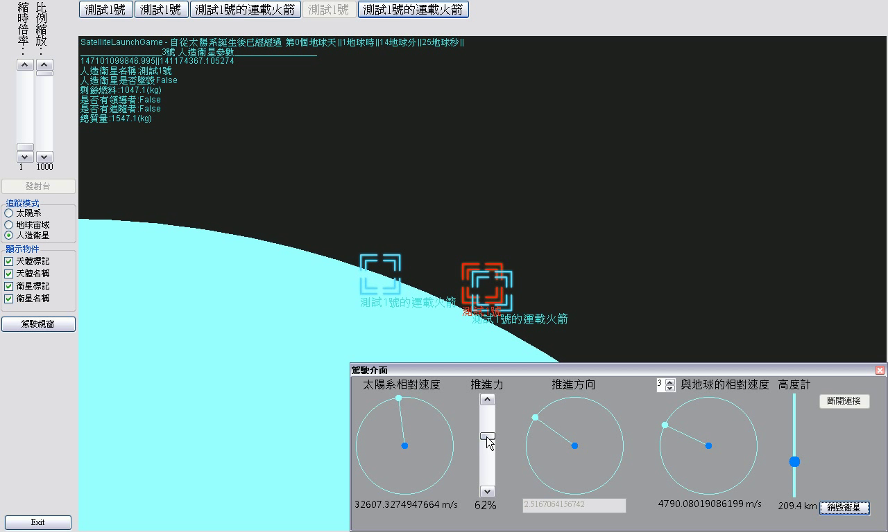

Simple Satellite Launch Game
===
This side project was written when I was senior (industrial) vocational high school student in 2015, and I don't use VB.NET any more, so there are not been refactoring, which the code been a bit of messing up and not document or build guide.

### Video Demo

>")

### Require (?)
- Visual Basic 2010
- .NET Framework stuff